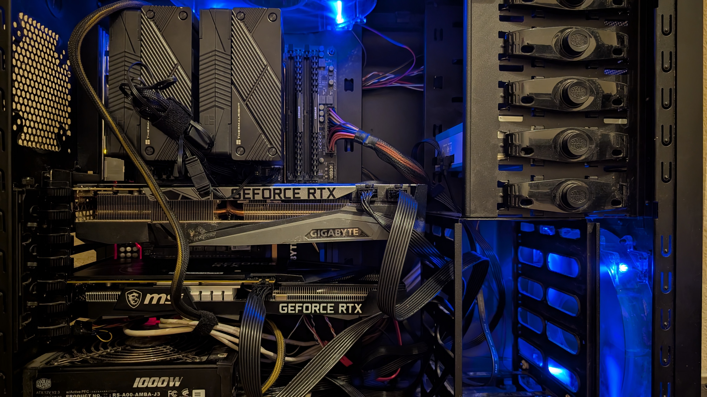
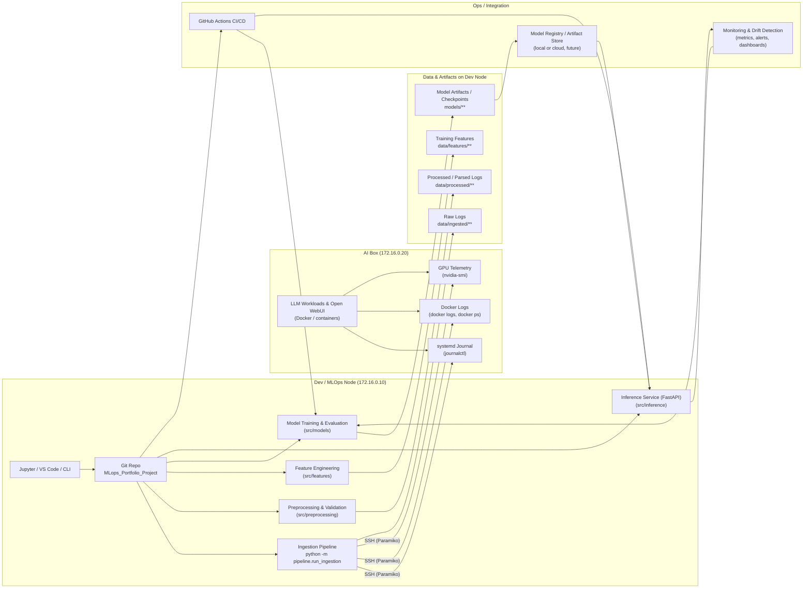

# MLOps Portfolio Project  
## Real-World Log Anomaly Detection Using a Multi-GPU Home Lab AI Server

---

## Overview

This project is an end-to-end **MLOps engineering demonstration** built around a realistic production-inspired environment:  
my **multi-GPU home-lab AI server**.

Instead of relying on toy datasets, this project collects **real operational logs** from a live machine running:

- Local LLM inference (Ollama, Open-WebUI, HuggingFace GGUF models)  
- Dockerized services  
- GPU-accelerated workloads  
- Linux system daemons  
- High-power PSU + multi-fan cooling under varying thermal loads  

These logs feed a complete ML-driven **anomaly detection pipeline**, similar to what real-world Data/AI/Platform teams use to monitor production AI services.

---

## 🖥️Hardware Platform — *The AI Box*

This workstation generates realistic operational logs suitable for anomaly detection and MLOps workflows.

| Component | Details |
|----------|---------|
| **CPU** | Intel Core i7-6950X (10 cores / 20 threads) |
| **Motherboard** | Gigabyte X99P-SLI-CF |
| **Memory** | 32 GB DDR4 |
| **GPUs** | NVIDIA RTX 3090 (24 GB VRAM) + NVIDIA RTX 3060 (12 GB VRAM) |
| **Total VRAM** | 36 GB |
| **Power Supply** | Cooler Master 1000W |
| **Cooling** | Dual Thermaltake tower coolers + case fans |
| **Workload** | Local LLM inference, Docker services, GPU-heavy operations |

---

## Project Goal

Design and deploy a **production-style anomaly detection system** capable of identifying:

- abnormal GPU behavior  
- service failures  
- thermal anomalies  
- container restarts  
- unusual system log sequences  

The focus is on building a real MLOps pipeline — not just training a model.

---

## 🏗️ Project Phases

### **Phase 1 — Log Collection + Exploration**
- Collect logs from systemd, Docker, GPU telemetry, and AI workloads  
- Parse and structure messages  
- Establish a baseline of normal behavior  

### **Phase 2 — Baseline ML Anomaly Detection**
- Use Isolation Forest, One-Class SVM, or statistical baselines  
- Detect deviations in log patterns  
- Build a simple inference script  

### **Phase 3 — Modular Training Pipeline**
Introduce `/src` modules for:
- ingestion  
- preprocessing  
- feature engineering  
- model training  
- batch/online inference  

### **Phase 4 — Experiment Tracking & Model Registry**
Add MLflow or Weights & Biases for:
- experiment tracking  
- parameter logging  
- artifact storage  
- model versioning  

### **Phase 5 — Deployment**
Deploy the model as:
- a FastAPI inference service  
- containerized via Docker  
- optional scaling using Docker Compose or Kubernetes  

### **Phase 6 — Monitoring & Drift Detection**
Use EvidentlyAI or custom dashboards to monitor:
- data drift  
- anomaly rate changes  
- model performance decay  

### **Phase 7 — CI/CD for ML**
Add GitHub Actions to automate:
- testing  
- linting  
- container builds  
- model retraining  
- deployments  

---

## Why This Project Matters

Most ML portfolios show **notebooks**.  
Most DevOps portfolios show **infrastructure**.

This project demonstrates the **intersection — MLOps**:

- real data  
- real pipelines  
- reproducible experiments  
- deployment workflows  
- monitoring and observability  
- hardware + GPU awareness  
- automation  
- model lifecycle management  

It showcases skills that map directly onto modern ML Platform, MLOps, and AI engineering roles.

+++++++++++++++++++++++++++++++++++++++++++++++++++++++++++++++

