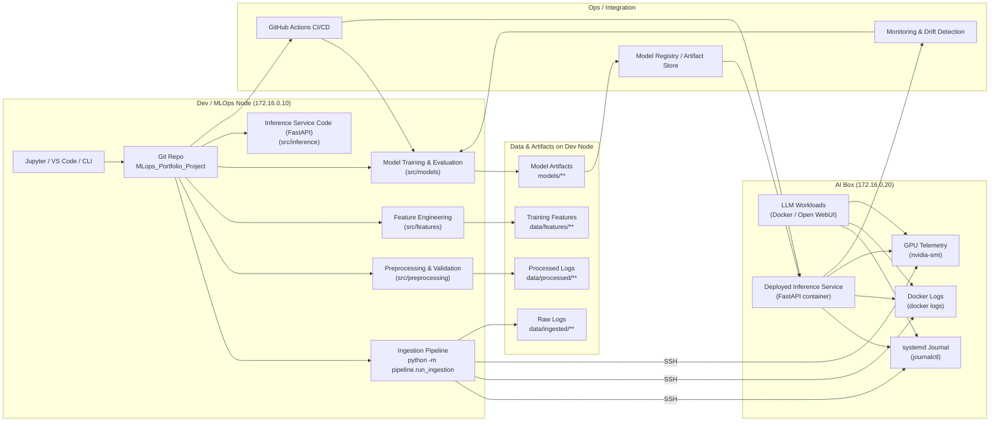

# MLOps Portfolio Project
## Real-World Log Anomaly Detection Using a Multi-GPU Home Lab AI Server


---

## Overview

This project is an end-to-end **MLOps engineering demonstration** built around a realistic production-inspired environment:
my **multi-GPU home-lab AI server**.

Instead of relying on toy datasets, this project collects **real operational logs** from a live machine running:

- Local LLM inference (Ollama, Open-WebUI, HuggingFace GGUF models)
- Dockerized services
- GPU-accelerated workloads
- Linux system daemons
- High-power PSU + multi-fan cooling under varying thermal loads

These logs feed a complete ML-driven **anomaly detection pipeline**, similar to what real-world Data/AI/Platform teams use to monitor production AI services.

---

## Hardware Platform — *The AI Box*

| Component | Details |
|----------|---------|
| **CPU** | Intel Core i7-6950X |
| **Motherboard** | Gigabyte X99P-SLI-CF |
| **Memory** | 32 GB DDR4 |
| **GPUs** | NVIDIA RTX 3090 (24 GB) + RTX 3060 (12 GB) |
| **Total VRAM** | 36 GB |
| **PSU** | 1000W |
| **Cooling** | Dual tower coolers + case fans |
| **Workload** | Local LLM inference and GPU-heavy operations |

---

## Project Goal

Build a **production-style anomaly detection system** capable of identifying:

- abnormal GPU behavior  
- service failures  
- thermal anomalies  
- container restarts  
- unusual sequence patterns in logs  

---

# Current Pipeline Implementation

This repository now implements:

1. Remote ingestion of logs + GPU telemetry  
2. Normalization and preprocessing into a unified schema  
3. Production-style output artifacts: JSONL + Parquet  

---

## Ingestion Pipeline (SSH → AI Box → Raw Logs)

The ingestion runner is:

```bash
python -m pipeline.run_ingestion
```

This command:  
- SSH’s into the AI box (172.16.0.20) using Paramiko  
- Runs:  
```bash
journalctl --output=json          # systemd logs
docker ps + docker logs           # container logs
nvidia-smi --query-gpu=... --format=csv,noheader,nounits   # GPU metrics
```
- Writes raw JSONL artifacts under:  
```bash
data/ingested/systemd/systemd_logs_*.jsonl
data/ingested/docker/docker_logs_*.jsonl
data/ingested/gpu/gpu_metrics_*.jsonl
```
Each record is tagged with:  
- source = systemd | docker | gpu  
- host  
- plus additional metadata (units, container names, GPU fields)  


##  Normalization & Preprocessing (JSONL → Unified Events → Parquet)

Run:  
```bash
python -m src.preprocessing.parser
```

This performs:  

- Timestamp normalization (microseconds → ISO-8601)  
- Schema unification  
- Deduplication-friendly structured format  
  
Produces:  
- data/processed/combined_events.jsonl  
- data/processed/combined_events.parquet  
  
Example Unified Event (structure)
```bash
{
  "timestamp": "2025-12-06T17:20:30.123456+00:00",
  "source": "docker",
  "host": "AI-box",
  "category": "log",
  "subtype": "docker",
  "container_name": "open-webui",
  "message": "...",
}
```

## Quick Data Exploration (from Parquet)

Use pandas to verify everything. View it under the notebook directory.  


## 🏗️ Project Phases (Full Roadmap)

Phase 1 — Log Collection + Exploration✔️ Done  
Phase 2 — Baseline ML Anomaly Detection  
Phase 3 — Training Pipeline  
Phase 4 — Model Registry + Experiment Tracking  
Phase 5 — Deployment (FastAPI + Docker)  
Phase 6 — Monitoring & Drift Detection  
Phase 7 — CI/CD (GitHub Actions)  



